# Content Marketing Swarm - Architecture Diagram

## System Overview


## Request Flow


## Component Details

### 1. API Endpoint

```python
# backend/app/api/content.py
@router.post("/generate-content", response_model=ContentGenerationResponse)
async def generate_content(request: ContentGenerationRequest, db: Session = Depends(get_db)):
    # Create invocation state with requested platforms
    invocation_state = create_invocation_state(
        user_id=request.user_id,
        database_session=db,
        platforms=request.platforms
    )
    
    # Execute swarm
    swarm = create_swarm(streaming=False)
    swarm_result = swarm(prompt=request.prompt, invocation_state=invocation_state)
    
    # Extract agent output
    agent_output = extract_agent_output(swarm_result)
    
    # Parse content
    parser = ContentParser()
    parse_result = parser.parse_agent_output(
        agent_output,
        platform="multi",
        requested_platforms=request.platforms
    )
    
    # Create content items
    for content_data in parse_result['content_items']:
        content_item = ContentItem(...)
        content_repo.create(content_item)
    
    return ContentGenerationResponse(content_items=content_items, ...)
```

### 2. Content Parser

```python
# backend/app/parsers/content_parser.py
class ContentParser:
    PLATFORM_SECTION_PATTERN = re.compile(
        r'^\s*###?\s*(?:📱|📈|🐦|💼|📊)?\s*\*?\*?(LinkedIn|Twitter|Instagram|Facebook|Pitch\s*Deck)\s*(?:Content|Post)?\*?\*?[:\s]*\n+(.*?)(?=^\s*###?\s*(?:📱|📈|🐦|💼|📊)?\s*\*?\*?(?:LinkedIn|Twitter|Instagram|Facebook|Pitch\s*Deck)|\Z)',
        re.DOTALL | re.IGNORECASE | re.MULTILINE
    )
    
    def parse_agent_output(self, agent_response: str, platform: str, requested_platforms: List[str]) -> Dict:
        # Extract platform sections using regex
        platform_matches = self.PLATFORM_SECTION_PATTERN.findall(agent_response)
        
        # Create content items for each platform
        content_items = []
        for platform_name, content_text in platform_matches:
            content_items.append({
                'platform': self._normalize_platform_name(platform_name),
                'content': content_text.strip(),
                'hashtags': self.extract_hashtags(content_text),
                'media_urls': [],
                'metadata': self.extract_metadata(content_text, platform)
            })
        
        return {'content_items': content_items, ...}
```

### 3. Platform Detection Flow

```mermaid
graph LR
    subgraph "Agent Output"
        OUTPUT["### 💼 LinkedIn\n...\n### 🐦 Twitter\n...\n### 📊 Pitch Deck\n..."]
    end
    
    subgraph "Parser Regex"
        REGEX["PLATFORM_SECTION_PATTERN<br/>Handles leading whitespace<br/>MULTILINE flag<br/>Matches all headers"]
    end
    
    subgraph "Parsed Results"
        ITEMS["content_items: 3 items<br/>- platform: linkedin<br/>- platform: twitter<br/>- platform: pitch_deck"]
    end
    
    OUTPUT --> REGEX
    REGEX --> ITEMS
```



## Infrastructure Architecture

```mermaid
graph TB
    subgraph "AWS Cloud - us-east-1"
        subgraph "VPC"
            subgraph "Public Subnets"
                ALB[Application Load Balancer<br/>HTTPS Listener<br/>Target Group]
            end
            
            subgraph "Private Subnets"
                subgraph "ECS Cluster"
                    TASK1[Fargate Task 1<br/>Image: afd1fd38...<br/>Started: 13:20:56 UTC]
                    TASK2[Fargate Task 2<br/>Image: afd1fd38...<br/>Started: 13:20:56 UTC]
                end
                
                RDS[(RDS PostgreSQL<br/>Multi-AZ)]
            end
        end
        
        subgraph "ECR"
            ECR[ECR Repository<br/>content-marketing-swarm-backend<br/>latest: sha256:afd1fd38...]
        end
        
        subgraph "S3"
            S3_IMAGES[S3 Bucket<br/>Generated Images]
            S3_FRONTEND[S3 Bucket<br/>Frontend Static Files]
        end
        
        subgraph "CloudFront"
            CF[CloudFront Distribution<br/>d2b386ss3jk33z.cloudfront.net]
        end
        
        subgraph "Route 53"
            R53[Custom Domain<br/>api.blacksteep.com]
        end
        
        subgraph "Bedrock"
            BEDROCK_LLM[Claude Sonnet 4.5<br/>Text Generation]
            BEDROCK_IMG[Amazon Nova Canvas<br/>Image Generation]
            BEDROCK_KB[Knowledge Base<br/>Semantic Search]
        end
        
        subgraph "Monitoring"
            CW_LOGS[CloudWatch Logs<br/>/aws/content-marketing-swarm]
            CW_METRICS[CloudWatch Metrics<br/>Custom Metrics]
        end
        
        subgraph "AgentCore"
            AGENTCORE_GW[AgentCore Gateway<br/>MCP Gateway<br/>OAuth Authorizer]
            COGNITO[Amazon Cognito<br/>User Pool<br/>OAuth2 Provider]
        end
    end
    
    subgraph "External"
        USERS[Users]
        LINKEDIN_EXT[LinkedIn API<br/>api.linkedin.com]
        TWITTER_EXT[Twitter API<br/>api.twitter.com]
    end
    
    USERS -->|HTTPS| R53
    USERS -->|HTTPS| CF
    R53 --> ALB
    CF --> S3_FRONTEND
    
    ALB --> TASK1
    ALB --> TASK2
    
    TASK1 --> RDS
    TASK2 --> RDS
    
    TASK1 -.->|Pull Image| ECR
    TASK2 -.->|Pull Image| ECR
    
    TASK1 -.->|Generate Text| BEDROCK_LLM
    TASK1 -.->|Generate Images| BEDROCK_IMG
    TASK1 -.->|Search| BEDROCK_KB
    TASK1 -.->|Upload| S3_IMAGES
    TASK1 -.->|Publish via MCP| AGENTCORE_GW
    
    TASK2 -.->|Generate Text| BEDROCK_LLM
    TASK2 -.->|Generate Images| BEDROCK_IMG
    TASK2 -.->|Search| BEDROCK_KB
    TASK2 -.->|Upload| S3_IMAGES
    TASK2 -.->|Publish via MCP| AGENTCORE_GW
    
    AGENTCORE_GW -.->|OAuth| COGNITO
    AGENTCORE_GW -.->|Authenticated| LINKEDIN_EXT
    AGENTCORE_GW -.->|Authenticated| TWITTER_EXT
    
    TASK1 -.->|Logs| CW_LOGS
    TASK2 -.->|Logs| CW_LOGS
    TASK1 -.->|Metrics| CW_METRICS
    TASK2 -.->|Metrics| CW_METRICS
    
    style AGENTCORE_GW fill:#FFE6F0
    style COGNITO fill:#FFF4E6
    
    style TASK1 fill:#90EE90
    style TASK2 fill:#90EE90
    style ECR fill:#90EE90
```

## Deployment Architecture

```mermaid
graph LR
    subgraph "Development"
        CODE[Local Code<br/>✅ Fixes Applied]
        DOCKER[Docker Build<br/>Platform: linux/amd64]
    end
    
    subgraph "Container Registry"
        ECR_REPO[ECR Repository<br/>content-marketing-swarm-backend]
        ECR_IMAGE[Image: latest<br/>Digest: afd1fd38...]
    end
    
    subgraph "ECS Service"
        TASK_DEF[Task Definition<br/>Revision 9<br/>Image: :latest tag]
        SERVICE[ECS Service<br/>Desired: 2<br/>Running: 2]
        TASK_A[Task A<br/>✅ Using afd1fd38...]
        TASK_B[Task B<br/>✅ Using afd1fd38...]
    end
    
    CODE --> DOCKER
    DOCKER -->|docker push| ECR_REPO
    ECR_REPO --> ECR_IMAGE
    
    ECR_IMAGE -->|Referenced by| TASK_DEF
    TASK_DEF -->|Used by| SERVICE
    SERVICE -->|Runs| TASK_A
    SERVICE -->|Runs| TASK_B
```



## Data Flow


## AgentCore Gateway Architecture


### AgentCore Gateway Features

**Purpose**: Secure, managed access to third-party social media APIs

**Key Features**:
- **MCP Gateway**: Model Context Protocol gateway for standardized API access
- **OAuth2 Integration**: Cognito-based OAuth authorizer for secure authentication
- **Semantic Search**: Built-in semantic search capabilities for API discovery
- **Multi-Target Support**: Single gateway managing multiple API targets
- **Credential Management**: Secure storage and rotation of OAuth credentials

**Supported Platforms**:
1. **LinkedIn API**
   - Endpoint: `https://api.linkedin.com/v2`
   - Operations: Create posts (`/ugcPosts`)
   - Auth: OAuth2 with scopes: `w_member_social`, `r_liteprofile`

2. **Twitter/X API**
   - Endpoint: `https://api.twitter.com/2`
   - Operations: Create tweets (`/tweets`)
   - Auth: OAuth2 with scopes: `tweet.read`, `tweet.write`, `users.read`

**Integration Flow**:
```
Scheduler Agent → AgentCore Gateway → OAuth2 (Cognito) → Social Media API
```

## Technology Stack

| Layer | Technology | Purpose |
|-------|-----------|---------|
| **Frontend** | Next.js 14, React, TailwindCSS | User interface |
| **CDN** | CloudFront | Global content delivery |
| **Load Balancer** | Application Load Balancer | HTTPS/WSS routing |
| **API** | FastAPI, Python 3.11 | REST API & WebSocket |
| **Container** | Docker, ECS Fargate | Serverless containers |
| **Orchestration** | Strands Agents | Multi-agent swarm |
| **LLM** | Amazon Bedrock (Claude Sonnet 4.5) | Text generation |
| **Image Gen** | Amazon Nova Canvas | Image generation |
| **Knowledge** | Bedrock Knowledge Base | Semantic search |
| **Database** | PostgreSQL (RDS) | Persistent storage |
| **Storage** | S3 | Image storage |
| **Monitoring** | CloudWatch, X-Ray | Logs & traces |
| **Gateway** | **AgentCore Gateway** | **MCP Gateway with OAuth** |
| **Auth** | Amazon Cognito | OAuth2 provider |
| **Social APIs** | LinkedIn, Twitter/X | Content publishing |

## Deployment Information

**Environment**: Production  
**Region**: us-east-1  
**API Endpoint**: https://api.blacksteep.com  
**Frontend**: https://d2b386ss3jk33z.cloudfront.net  
**Container Image**: sha256:afd1fd382e1103d15aab4fcbd64bc5121b09caa97d491835f759cce86e9cb1d0  
**Running Tasks**: 2/2 ECS Fargate tasks
